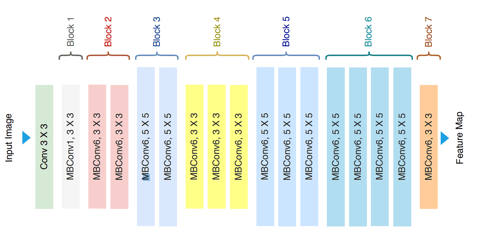
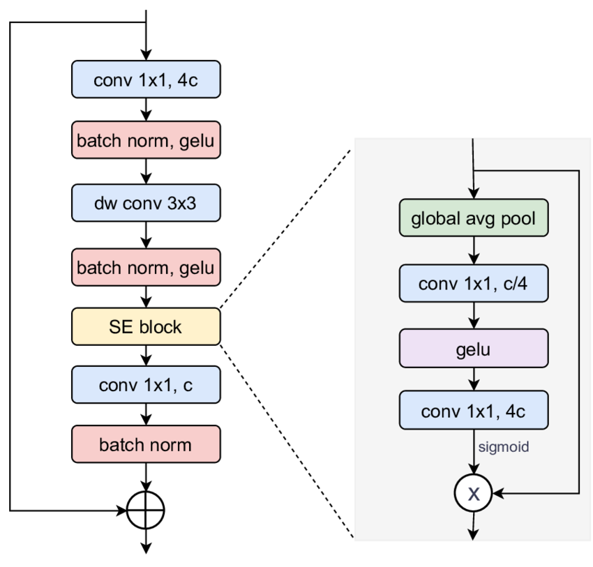
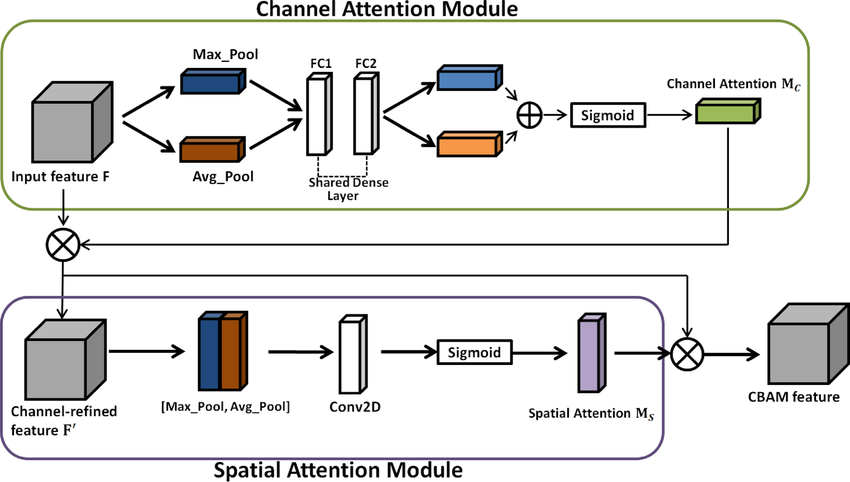
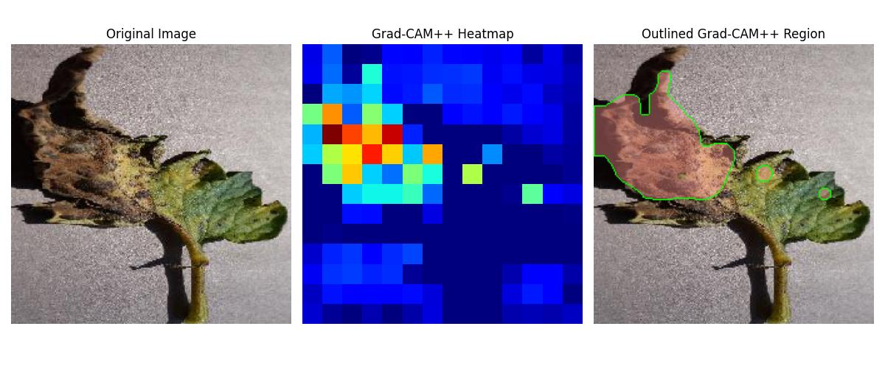
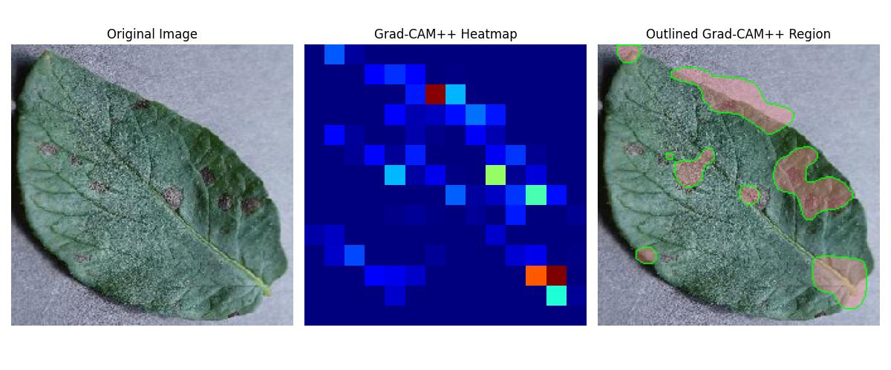
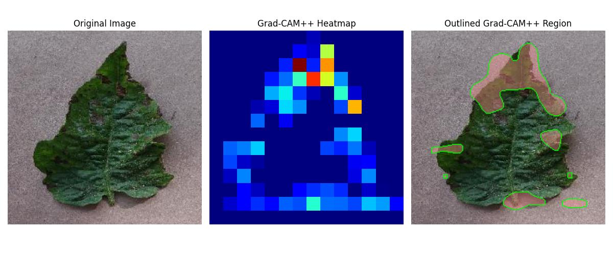

<h1>🌾 Monitoring Crop Health using Deep Learning and Grad-CAM++</h1>

<h2>📌 Project Objective:</h2>

This project simulates aerial crop health monitoring using deep learning and computer vision.  
The goal is to classify regions of crop images as <b>healthy</b> or <b>diseased</b> and visually highlight the affected areas using <b>Grad-CAM++ overlays</b>.

<h2>🧠 Models Used:</h2>
<ul>
  <li>✅ <b>EfficientNetB0 </b> – Lightweight CNN for plant disease detection</li>
  <li>✅ <b>EfficientNetB0 with CBAM</b> – Lightweight, attention-enhanced CNN optimized for better feature focus</li>
  <li>✅ <b>Grad-CAM++</b> – Visual explanation technique to highlight critical image regions contributing to the model's prediction</li>
</ul>

<h2>🗃️ Project Structure:</h2>

<pre>
MONITORING-CROP-HEALTH-USING-COMPUTER-VISION/
├── data/               📂 Sample datasets and image folders
│   └── test_images/    📂 Test images for Grad-CAM++ inference
├── models/             📂 Saved model weights (.h5)
│   ├── efficientnet_b0_cbam_model.h5
│   └── efficientnet_b0_final_model.h5
├── notebooks/          📓 Training and inference notebooks
│   ├── EfficientNet_b0_training.ipynb
│   ├── Efficient_net_b0_CBAM_training.ipynb
│   ├── project-evaluation.ipynb
│   └── project-inference.ipynb
├── src/                ⚙️ Source code files
│   ├── EfficientNet_CBAM_Architecture.ipynb
│   ├── EfficientNet_b0_Architecture.ipynb
│   └── GradCAM.ipynb
├── Output_Sample/      📁 Grad-CAM++ output examples
├── README.md           📄 Project documentation
</pre>

<h2>📦 Requirements:</h2>

<ul>
<li>Python (3.7+ recommended)</li>
<li>TensorFlow</li>
<li>OpenCV</li>
<li>NumPy</li>
<li>Matplotlib</li>
</ul>

<b>Install all dependencies:</b>

<pre><code>pip install -r requirements.txt</code></pre>

<h2>⚙️ Installation:</h2>
<ol>
<li>Clone the repository:</li>
<pre><code>git clone https://github.com/varssha22/MONITORING-CROP-HEALTH-USING-COMPUTER-VISION.git</code></pre>

<li>Navigate to the project directory:</li>
<pre><code>cd MONITORING-CROP-HEALTH-USING-COMPUTER-VISION</code></pre>

<li>Install dependencies:</li>
<pre><code>pip install -r requirements.txt</code></pre>
</ol>

<h2>🚀 Usage:</h2>
<ol>
<li>Place your dataset inside the <b>data/</b> folder following the required structure.</li>
<li>To train the models:</li>
<pre><code>Open notebooks/EfficientNet_b0_training.ipynb or notebooks/Efficient_net_b0_CBAM_training.ipynb and run all cells.</code></pre>

<li>To evaluate model performance:</li>
<pre><code>Run notebooks/project-evaluation.ipynb to generate classification reports and accuracy metrics.</code></pre>

<li>To visualize predictions with Grad-CAM++:</li>
<pre><code>Run notebooks/project-inference.ipynb to highlight diseased areas with heatmaps and outlines.</code></pre>
</ol>

<h2>📁 Dataset:</h2>
<ul>
<li>Used an <b>augmented plant disease dataset</b> from Kaggle.</li>
<li>Images categorized into various healthy and unhealthy classes.</li>
<li>Preprocessing included resizing, normalization, and train-test splitting.</li>
</ul>  

<h4>📊 EfficientNet B0 Model Architecture</h4>
  

<h4>🌾 MBConv Block</h4>
  

<h4>🌾 CBAM Module Illustration</h4>
  

<h2>🛠️ Model Training:</h2>
<ul>
<li>Models built using <b>Keras API</b> with <b>TensorFlow backend</b>.</li>
<li>Custom EfficientNetB0 with CBAM integrated for enhanced attention to diseased areas.</li>
<li>Training metrics like accuracy and loss visualized using matplotlib.</li>
</ul>

<h2>📄 Output:</h2>
<ul>
<li>Trained models saved under <code>/models/</code> in <b>.h5 format</b>.</li>
</ul>

<h2>🎯 Inference & Visualization:</h2>
<ul>
<li>Grad-CAM++ applied to test images to visually explain model predictions.</li>
<li>Red overlays highlight unhealthy/diseased regions of crops.</li>
<li>Comparison of original images, heatmaps, and outlined regions provided.</li>
</ul>

<h2>📂 Output Samples:</h2>

  
  
  

<h2>📈 Results:</h2>

<table border="1" cellpadding="5">
<thead>
<tr>
<th>Model</th>
<th>Accuracy</th>
<th>Parameters</th>
<th>Grad-CAM++ Compatible</th>
</tr>
</thead>
<tbody>
<tr>
<td>EfficientNetB0</td>
<td>100.0%</td>
<td>~7 Million 🔻</td>
<td>✅ Yes (Lightweight)</td>
</tr>
<tr>
<td>EfficientNetB0 + CBAM</td>
<td>99.0%</td>
<td>~7 Million 🔻</td>
<td>✅ Yes (Lightweight & Attention-Enhanced)</td>
</tr>
</tbody>
</table>

<h2>🤝 Acknowledgements:</h2>
<ul>
<li><a href="https://www.kaggle.com/datasets/vipoooool/new-plant-diseases-dataset">Kaggle – New Plant Diseases Dataset (Augmented)</a></li>
<li><a href="https://arxiv.org/pdf/1905.11946">EfficeintNet Paper</a></li>
<li><a href="https://arxiv.org/pdf/1807.06521v2">CBAM Paper</a></li>
<li>TensorFlow, OpenCV, and Keras Teams</li>
</ul>

<h2>📬 Contact:</h2>

For questions or collaborations, reach me via <a href="https://github.com/varssha22" target="_blank">GitHub Profile</a>.

